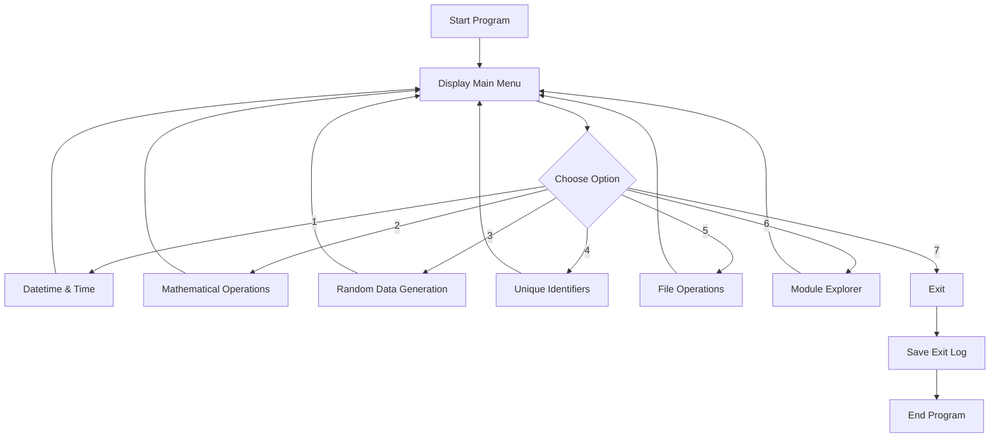

# 🧰 Moduler-Packager

### Multi-Utility Python Toolkit

A beginner-friendly, modular command-line toolkit that combines **date & time utilities, mathematical calculations, random data generation, unique ID generation, file operations, and Python module exploration** into one interactive application.

> **Write less code. Use reusable modules. Build more utilities.**

---

## 📌 Table of Contents

- [✨ About the Project](#-about-the-project)
- [🚀 Features](#-features)
- [🧩 Available Modules](#-available-modules)
- [🛠️ Technologies Used](#️-technologies-used)
- [📂 Project Structure](#-project-structure)
- [⚙️ Requirements](#️-requirements)
- [📥 Installation](#-installation)
- [▶️ How to Run](#️-how-to-run)
- [🖥️ Main Menu](#️-main-menu)
- [📅 Datetime & Time Operations](#-datetime--time-operations)
- [🧮 Mathematical Operations](#-mathematical-operations)
- [🎲 Random Data Generation](#-random-data-generation)
- [🆔 Unique Identifier Generation](#-unique-identifier-generation)
- [📁 File Operations](#-file-operations)
- [🔍 Module Explorer](#-module-explorer)
- [📝 Logging](#-logging)
- [🔄 Application Flow](#-application-flow)
- [📊 Feature Status](#-feature-status)
- [🎓 Learning Outcomes](#-learning-outcomes)
- [🔮 Future Improvements](#-future-improvements)
- [🤝 Contributing](#-contributing)
- [📜 License](#-license)

---

# ✨ About the Project

**Moduler-Packager** is a command-line **Multi-Utility Toolkit built with Python**.

Instead of creating separate programs for common tasks, this project brings multiple utilities together through a single interactive menu.

The application currently provides:

- Date and time utilities
- Mathematical calculations
- Unit conversions
- Random data generation
- Password and OTP generation
- Dice game
- UUID generation
- Invoice and session IDs
- File creation and manipulation
- Python module attribute exploration
- Automatic activity logging

The main application imports reusable utilities from the `toolkit` package and presents them through an easy-to-use terminal interface.

---

# 🚀 Features

| Feature | Description | Status |
|---|---|---|
| 📅 Datetime Utilities | Current time, date difference, formatting, stopwatch, countdown and working hours | ✅ |
| 🧮 Mathematics | Factorial, compound interest, trigonometry, areas, logarithms and number operations | ✅ |
| 🔄 Unit Conversion | Distance, weight and temperature conversions | ✅ |
| 🎲 Random Data | Numbers, lists, passwords, OTPs, sampling and dice game | ✅ |
| 🆔 UUID Generator | UUID, invoice ID and session ID generation | ✅ |
| 📁 File Operations | Create, write, read, append and replace file content | ✅ |
| 🔍 Module Explorer | Explore public attributes of Python modules | ✅ |
| 📝 Activity Logging | Saves toolkit activity to a log file | ✅ |
| 💻 CLI Interface | Interactive terminal-based menus | ✅ |
| 🧩 Modular Design | Utilities are separated into reusable modules | ✅ |

---

# 🧩 Available Modules

The toolkit is organized around reusable modules such as:

```text
toolkit/
├── datetime_utils.py
├── math_utils.py
├── random_utils.py
├── uuid_utils.py
├── file_ops.py
└── unit_utils.py
```

The main program imports these modules and uses their functions rather than placing every operation directly inside `main.py`.

This makes the project easier to understand, maintain and extend.

---

# 🛠️ Technologies Used

### Programming Language

- 🐍 Python 3

### Python Concepts

- Functions
- Modules
- Packages
- Imports
- Loops
- Conditional statements
- Exception handling
- User input
- String manipulation
- File handling
- `importlib`
- `dir()`
- Random number generation
- Date and time operations

### Standard Libraries

The project uses Python's standard library and does not require third-party packages.

Examples include:

```python
datetime
math
random
uuid
os
importlib
time
```

---

# 📂 Project Structure

```text
Moduler-Packager/
│
├── main.py
│
├── toolkit/
│   ├── datetime_utils.py
│   ├── math_utils.py
│   ├── random_utils.py
│   ├── uuid_utils.py
│   ├── file_ops.py
│   └── unit_utils.py
│
├── USER_GUIDE.md
├── sample_output.txt
├── toolkit_log.txt
├── .gitignore
└── README.md
```

### `main.py`

The main entry point of the application.

It:

- Displays the main menu
- Takes user input
- Opens the required submenu
- Calls functions from the toolkit modules
- Handles invalid input
- Controls the overall program flow

### `toolkit/`

Contains the reusable utility modules.

### `USER_GUIDE.md`

Provides a quick guide explaining how to use the toolkit and its available operations.

### `sample_output.txt`

Contains example program output.

### `toolkit_log.txt`

Stores activity logs generated while using the application.

---

# ⚙️ Requirements

You need:

- Python 3.x
- Terminal / Command Prompt
- VS Code or another Python editor

No external Python packages are required.

---

# 📥 Installation

## 1. Clone the Repository

```bash
git clone https://github.com/Rami-Manan/Moduler-Packager.git
```

## 2. Enter the Project Directory

```bash
cd Moduler-Packager
```

## 3. Verify Python

```bash
python --version
```

If your system uses `python3`:

```bash
python3 --version
```

---

# ▶️ How to Run

Run the main program:

```bash
python main.py
```

On systems using `python3`:

```bash
python3 main.py
```

The toolkit will display the main menu.

---

# 🖥️ Main Menu

When the program starts, it provides the following options:

```text
========================================
Welcome to Multi-Utility Toolkit
========================================

Choose an option:

1. Datetime and Time Operations
2. Mathematical Operations
3. Random Data Generation
4. Generate Unique Identifiers (UUID)
5. File Operations (Custom Module)
6. Explore Module Attributes (dir())
7. Exit
```

Choose an option by entering its corresponding number.

---

# 📅 Datetime & Time Operations

Select:

```text
1. Datetime and Time Operations
```

Available operations:

| Option | Operation |
|---|---|
| 1 | Display current date and time |
| 2 | Calculate difference between two dates |
| 3 | Format date into a custom format |
| 4 | Stopwatch |
| 5 | Countdown Timer |
| 6 | Working Hours Calculator |
| 7 | Back to Main Menu |

### Example

```text
Current Date and Time: 2026-10-05 09:30:20
```

Date differences can be calculated using dates such as:

```text
2026-10-01
2026-10-05
```

The toolkit also supports custom date formatting.

Example:

```text
%d/%m/%Y
```

---

# 🧮 Mathematical Operations

Select:

```text
2. Mathematical Operations
```

Available operations include:

- Factorial
- Compound interest
- Trigonometric calculations
- Area of geometric shapes
- Logarithms
- Unit conversions
- GCD
- LCM
- Prime-number checking

### Example

```text
Mathematical Operations:

1. Calculate Factorial
2. Solve Compound Interest
3. Trigonometric Calculations
4. Area of Geometric Shapes
5. Logarithm
6. Unit Conversions
7. GCD, LCM and Prime Check
8. Back to Main Menu
```

### Geometric Areas

The toolkit supports:

- Circle
- Rectangle
- Triangle
- Square

---

# 🔄 Unit Conversions

The conversion utility supports:

### Distance

```text
Kilometres → Miles
Miles → Kilometres
```

### Weight

```text
Kilograms → Pounds
Pounds → Kilograms
```

### Temperature

```text
Celsius → Fahrenheit
Fahrenheit → Celsius
```

Example:

```text
Enter value: 10

Result: 6.21
```

---

# 🎲 Random Data Generation

Select:

```text
3. Random Data Generation
```

Available operations:

| Option | Feature |
|---|---|
| 1 | Generate Random Number |
| 2 | Generate Random List |
| 3 | Create Random Password |
| 4 | Generate Random OTP |
| 5 | Random Sampling from Data |
| 6 | Dice Game |
| 7 | Back to Main Menu |

### 🎯 Random Number

Generate a number between a minimum and maximum value.

### 🔐 Random Password

Generate a password based on the requested length.

### 🔢 Random OTP

Generate an OTP with the requested number of digits.

### 🎲 Dice Game

Play multiple rounds against the computer.

Example:

```text
Round 1 - You: 5 Computer: 2 -> You Win
Round 2 - You: 3 Computer: 6 -> Computer Wins
```

---

# 🆔 Unique Identifier Generation

Select:

```text
4. Generate Unique Identifiers (UUID)
```

The toolkit can generate:

- UUID
- Invoice ID
- Session ID

Example:

```text
Generate Unique Identifiers:

1. Generate UUID
2. Generate Invoice ID
3. Generate Session ID
4. Back to Main Menu
```

This demonstrates how unique identifiers can be generated programmatically.

---

# 📁 File Operations

Select:

```text
5. File Operations (Custom Module)
```

Available operations:

| Option | Operation |
|---|---|
| 1 | Create a new file |
| 2 | Write to a file |
| 3 | Read from a file |
| 4 | Append to a file |
| 5 | Replace text in a file |
| 6 | Back to Main Menu |

### Create a File

```text
Enter file name: example.txt
File created successfully!
```

### Write to a File

```text
Enter file name: example.txt
Enter data to write: Hello Python
Data written successfully!
```

### Read a File

```text
File Content:
Hello Python
```

### Append Data

Additional data can be added without replacing the existing content.

### Replace Text

The toolkit can search for specified text and replace it with new text.

---

# 🔍 Module Explorer

Select:

```text
6. Explore Module Attributes (dir())
```

This feature demonstrates Python's dynamic module inspection capabilities.

The user can enter a module name such as:

```text
math
```

or a project module such as:

```text
toolkit.math_utils
```

The program imports the module using `importlib` and uses `dir()` to display its publicly accessible attributes.

Example:

```text
Enter module name to explore: math

Available Attributes in math module:
[...]
```

This is particularly useful for learning how Python modules can be inspected programmatically.

---

# 📝 Logging

The application records activities in:

```text
toolkit_log.txt
```

Examples of logged actions include:

```text
Program started
Showed current date and time
Random number generated
Conversion performed
File created
File read
Program closed
```

This provides a basic example of maintaining an application activity log.

---

# 🔄 Application Flow



---

# 🏗️ Architecture

The project follows a simple modular architecture:

```text
                    ┌─────────────────────┐
                    │      User / CLI     │
                    └──────────┬──────────┘
                               │
                               ▼
                    ┌─────────────────────┐
                    │       main.py       │
                    │   Main Menu / Flow  │
                    └──────────┬──────────┘
                               │
             ┌─────────────────┼──────────────────┐
             │                 │                  │
             ▼                 ▼                  ▼
     ┌──────────────┐  ┌──────────────┐  ┌──────────────┐
     │ datetime_utils│  │  math_utils  │  │ random_utils │
     └──────────────┘  └──────────────┘  └──────────────┘
             │                 │                  │
             └─────────────────┼──────────────────┘
                               │
             ┌─────────────────┼──────────────────┐
             ▼                 ▼                  ▼
     ┌──────────────┐  ┌──────────────┐  ┌──────────────┐
     │  uuid_utils  │  │   file_ops   │  │  unit_utils  │
     └──────────────┘  └──────────────┘  └──────────────┘
                               │
                               ▼
                    ┌─────────────────────┐
                    │ toolkit_log.txt     │
                    └─────────────────────┘
```

### Why modular design?

Instead of putting every function into one large Python file, related functionality is separated into individual modules.

For example:

```text
datetime_utils.py
```

handles date/time functionality, while:

```text
math_utils.py
```

handles mathematical operations.

This makes the project easier to:

- Read
- Debug
- Maintain
- Reuse
- Extend

---

# 📊 Feature Status

| Feature | Status |
|---|---|
| 📅 Datetime & Time | 100% |
| 🧮 Mathematical Operations | 100% |
| 🔄 Unit Conversion | 100% |
| 🎲 Random Data Generation | 100% |
| 🆔 UUID Generation | 100% |
| 📁 File Operations | 100% |
| 🔍 Module Explorer | 100% |
| 📝 Activity Logging | 100% |
| 💻 Command-Line Interface | 100% |

---

# 🛡️ Error Handling

The application includes basic error handling for invalid input and common operation failures.

For example:

```text
Invalid input, please try again.
```

File operations also handle missing files:

```text
File not found. Create it first.
```

This prevents common user mistakes from immediately terminating the application.

---

# 🎓 Learning Outcomes

This project is useful for practising several important Python concepts:

### 🐍 Python Fundamentals

- Variables
- Functions
- Loops
- Conditional statements
- User input
- String operations

### 🧩 Modular Programming

- Creating modules
- Importing modules
- Organizing related functions
- Reusing code

### 📁 File Handling

- Creating files
- Reading files
- Writing files
- Appending data
- Replacing content

### ⚠️ Exception Handling

- `try`
- `except`
- `ValueError`
- `FileNotFoundError`
- Input validation

### 🔎 Python Introspection

- `importlib`
- `dir()`
- Dynamic module importing

### 🧮 Practical Programming

- Mathematical formulas
- Date calculations
- Random data generation
- Unique identifier generation
- Unit conversions

---

# 🔮 Future Improvements

Possible improvements for future versions:

- [ ] Add a graphical user interface
- [ ] Add configuration settings
- [ ] Add more mathematical utilities
- [ ] Add currency conversion
- [ ] Add more file-management operations
- [ ] Add JSON and CSV support
- [ ] Add automated unit tests
- [ ] Add command-line arguments
- [ ] Add colored terminal output
- [ ] Add package installation support
- [ ] Add proper Python package metadata
- [ ] Add CI/CD with GitHub Actions

---

# 🤝 Contributing

Contributions are welcome.

### 1. Fork the repository

```bash
git clone https://github.com/Rami-Manan/Moduler-Packager.git
```

### 2. Create a new branch

```bash
git checkout -b feature/new-utility
```

### 3. Make your changes

Add or improve a utility while keeping the modular project structure.

### 4. Commit your changes

```bash
git add .
git commit -m "Add new utility"
```

### 5. Push your branch

```bash
git push origin feature/new-utility
```

### 6. Open a Pull Request

Describe what you changed and why.

---

# 📜 License

If a license file has not yet been added to the repository, add an appropriate open-source license before presenting the project as officially licensed.

---

# 👨‍💻 Author

**Manan Rami**

GitHub:

**Rami-Manan**

Repository:

`https://github.com/Rami-Manan/Moduler-Packager`

---

# ⭐ Support the Project

If you find this project useful:

⭐ Star the repository  
🍴 Fork it  
🐛 Report issues  
💡 Suggest new utilities  
🤝 Contribute improvements

---

## 🧰 Built with Python

```text
Python
   │
   ├── Datetime Utilities
   ├── Mathematical Utilities
   ├── Random Utilities
   ├── UUID Utilities
   ├── File Utilities
   └── Unit Utilities
            │
            ▼
      Multi-Utility Toolkit
```

**One CLI. Multiple utilities. Modular Python. 🚀**
